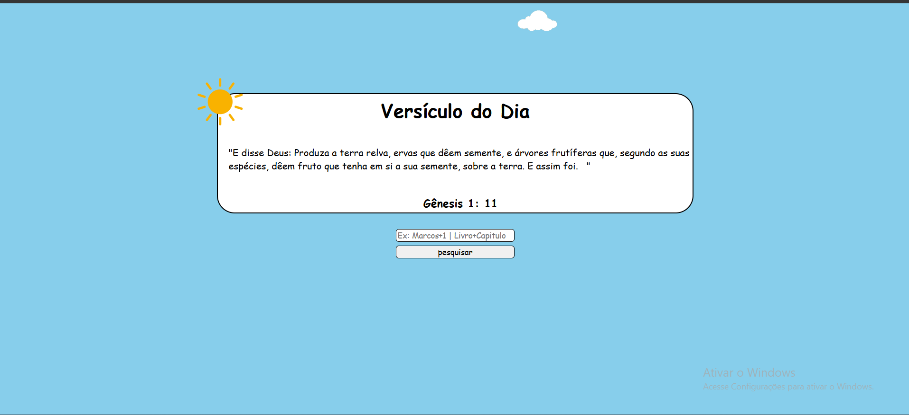

# Gerador de Versículos Bíblicos
- O Gerador de Versículos Bíblicos é uma aplicação web desenvolvida em PHP (versão 7.4), utilizando o padrão de arquitetura MVC (Model-View-Controller) e o gerenciador de dependências Composer. O objetivo principal do projeto é oferecer uma interface simples e intuitiva para os usuários acessarem versículos bíblicos de forma aleatória ou específica. O sistema consome a API pública Bible API para obter as informações dos versículos, garantindo atualizações em tempo real e flexibilidade de conteúdo.



# Principais Funcionalidades:
- Busca por Referência Específica: Permite ao usuário buscar um versículo específico informando o livro, capítulo (ex.: "Gênesis+1").
- Versículo Aleatório: Apresenta um versículo aleatório para inspiração ou reflexão.
- Tradução Almeida: Todas as referências bíblicas são exibidas na tradução Almeida, conforme disponibilizado pela API.

# Requisitos do Sistema:
- Linguagem: PHP 7.4
- Gerenciador de Dependências: Composer
- Padrão de Arquitetura: MVC (Model-View-Controller)
- API Externa: Bible API para obtenção de versículos.

##  Requisitos do Ambiente de Desenvolvimento:
- PHP Extensions Necessárias:
- cURL: Para fazer requisições HTTP à API externa.
- JSON: Para manipulação das respostas da API.

## Clonar o Repositório:
````
git clone https://github.com/Teslaneto/Biblia.git
````
